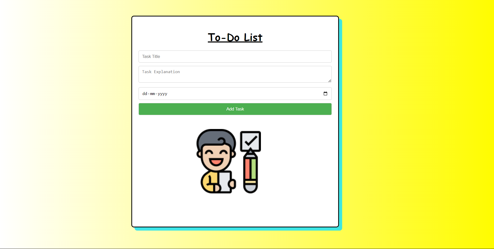

# TO-DO-LIST-Final-Project-SCM-
<!-- HTML table with inline CSS styles -->
<h1 style="color:blue;">TO-DO LIST</h1>
<h4>Description:</h4>

This is a simple To-Do List application designed to help users organize their tasks efficiently. Users can add, delete, and mark tasks as completed, keeping track of their progress easily. This is a very simple and easy design for all age users so that it is easy to use and understand. Application is made to increase productivity. 

<h2>TEAM MEMBERS</h2>
<h5>MEHRAAB SINGH (2310992152)</h5>
<h5>MISHIKA GARG (2310992153)</h5>
<h5>MITUL GOYAL (2310992154)</h5>

This to do list project is made using HTML(Hypertext Markup Language) which makes the structure layout and function of the project.

<h4>Features:</h4>

<b>Add Task:</b> Users can add new tasks by typing them into the input field and pressing enter.
<b>Delete Task:</b> Tasks can be deleted individually by clicking on the delete button next to each task.
<b>Mark as Completed:</b> Users can mark tasks as completed by clicking on the checkbox next to each task.
<b>Filtering:</b> Users can filter tasks by All Tasks, Active Tasks, and Completed Tasks, providing better organization.
<b>Clear Completed:</b> Users can remove all completed tasks with a single click for a clutter-free interface.
<b>Local Storage:</b> Tasks are saved to the browser's local storage, allowing users to access their tasks even after closing the browser.

  
<table style="width: 100%; border-collapse: collapse;">
    <tr style="background-color: #4CAF50; color: white;">
        <th style="padding: 8px; text-align: left;">S. No.</th>
        <th style="padding: 8px; text-align: left;">Version</th>
        <th style="padding: 8px; text-align: left;">Feature</th>
        <th style="padding: 8px; text-align: left;">Owners</th>
        <th style="padding: 8px; text-align: left;">Deadline</th>
    </tr>
    <tr style="background-color: #f2f2f2;">
        <td style="padding: 8px; text-align: left;">1</td>
        <td style="padding: 8px; text-align: left;">V.1</td>
        <td style="padding: 8px; text-align: left;">Simple and user-friendly interface</td>
        <td style="padding: 8px; text-align: left;">Mehraab Singh</td>
        <td style="padding: 8px; text-align: left;">30th April 24 </td>
    </tr>
    <tr style="background-color: #ffffff;">
        <td style="padding: 8px; text-align: left;">2</td>
        <td style="padding: 8px; text-align: left;">V.2</td>
        <td style="padding: 8px; text-align: left;">Set due dates & Title and explanation of the task</td>
        <td style="padding: 8px; text-align: left;">Mitul Goyal</td>
        <td style="padding: 8px; text-align: left;">5th May 24 </td>
    </tr>
    <tr style="background-color: #f2f2f2;">
        <td style="padding: 8px; text-align: left;">3</td>
        <td style="padding: 8px; text-align: left;">V.3</td>
        <td style="padding: 8px; text-align: left;">Enhancing the interface</td>
        <td style="padding: 8px; text-align: left;">Mishika Garg</td>
        <td style="padding: 8px; text-align: left;">9th May 23 </td>
    </tr>
</table>

# TO-DO-LIST Final Look

